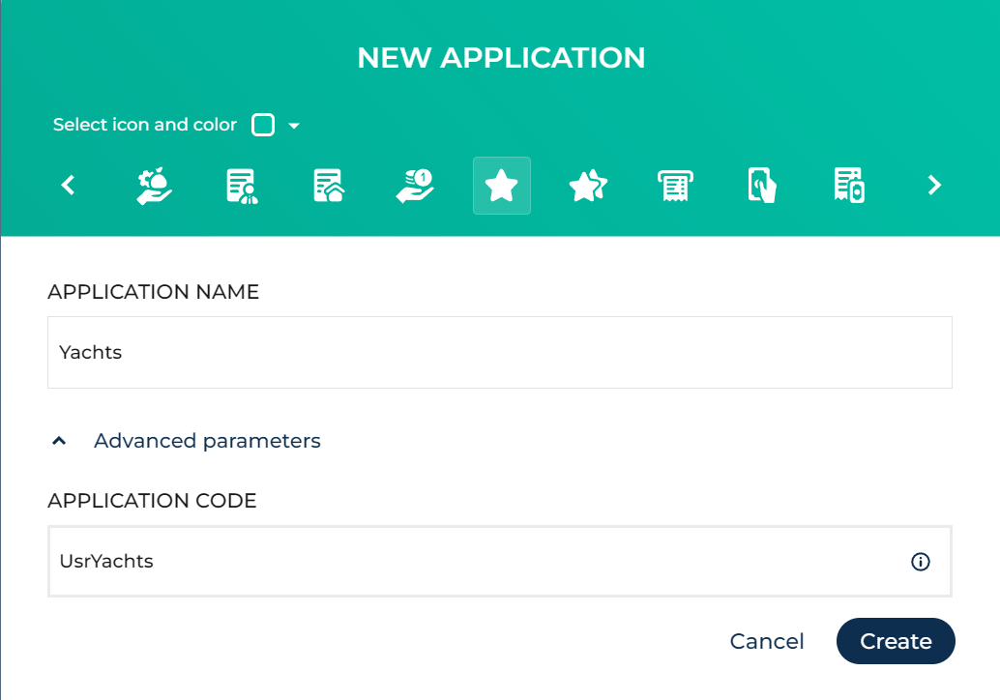
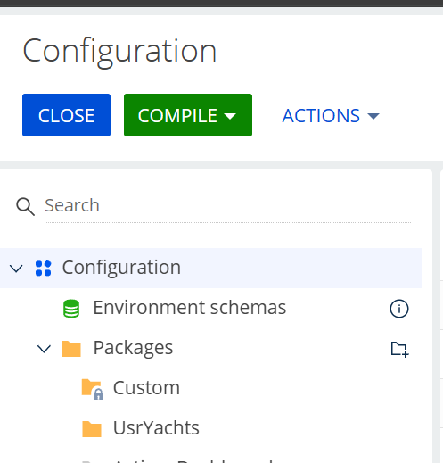
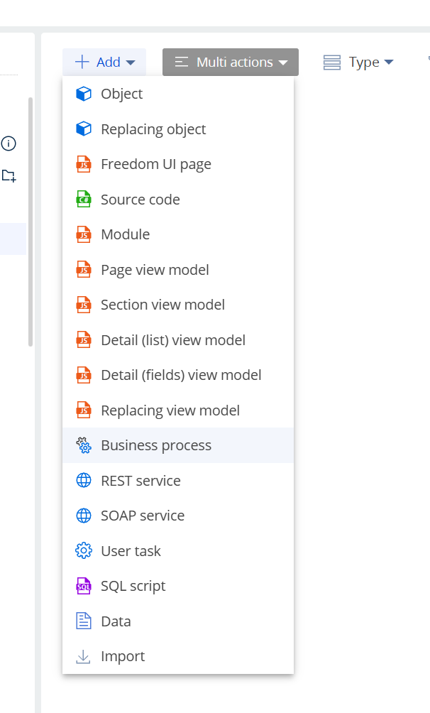
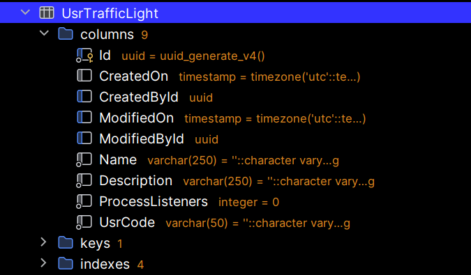

## Что где разрабатывается (Server vs Client)

### Server-side (C# / .NET)
- **Source code** (C#) живёт внутри пакета и компилируется в сборки.
- Результат компиляции — **assembly** (DLL), которую Creatio использует на сервере.
- Компиляция выполняется **внутри Creatio (Configuration → Compile)**.


### Client-side (JS)
- Клиентская логика (модули, схемы страниц, view models и т.п.) — **JavaScript** (и связанные ресурсы).
> Важное правило: **код пишется в IDE**, но “применение” (compile/build) делается через **Creatio**.
---
## 1) Docker Compose: какие volume нужны и зачем

### 1.1 `Terrasoft.WebHost.dll.config` как volume (чтобы не пересобирать образ)
Чтобы менять настройки (например, включать dev mode / FSD) без `docker compose build`:

```yaml
- ./creatio/Terrasoft.WebHost.dll.config:/app/Terrasoft.WebHost.dll.config:ro
```

### 1.2 `Terrasoft.Configuration` как volume (чтобы “Download packages…” писал на диск Windows)
Это ключ для File System Development Mode — после экспорта пакетов файлы должны появляться в:

`.\creatio\Terrasoft.Configuration\Pkg\...`

```yaml
- ./creatio/Terrasoft.Configuration:/app/Terrasoft.Configuration
```

### 1.3 (Опционально) tempDirectoryPath как volume (диагностика экспорта/временных файлов)
Если в `ConnectionStrings.config` задано:

```xml
<add name="tempDirectoryPath" connectionString="/tmp/creatio" />
```

Можно примонтировать `/tmp/creatio` на хост:

```yaml
- ./creatio/temp:/tmp/creatio
```

---

## 2) Включить режим работы с внешними IDE (File System Development Mode)

Документация:  
https://academy.creatio.com/docs/8.x/dev/development-on-creatio-platform/development-tools/external-ides/basics

### 2.1 Правки в `Terrasoft.WebHost.dll.config`

Включаем FSD:

```xml
<fileDesignMode enabled="true"/>
```

Отключаем “статический” контент:

```xml
<add key="UseStaticFileContent" value="false"/>
```

Далее:
- перезапустить контейнер Creatio
- перелогиниться в Creatio

```bash
docker compose restart creatio
```

---
## 3) Пример: создание приложения `UsrYachts`

### 3.1 Создаём Application в Hub
- Выбрать **Custom**
- Name: `Yachts`
- Code: `UsrYachts`



### 3.2 Проверяем, что пакет есть в Configuration
Путь в дереве: `Configuration → Packages → Custom → UsrYachts`



### 3.3 Добавляем артефакты пакета
В пакете можно создавать:
- **Object**
- **Freedom UI page**
- **Source code** (C#)
- **Module** (JS)
- **Business process**
- **SQL script**
- **Data**
- и т.д.





---


## 4) Dev-collaboration flow (Git + пакеты на файловой системе)

### 4.1 Что делает кнопка **Download packages to file system**
`Configuration → Actions → File system development mode → Download packages to file system`

Это:
- выгрузка пакетов из системы на файловую систему
- в каталог `Terrasoft.Configuration/Pkg/<PackageName>/...`
- чтобы можно было:
    - работать из IDE с файловой структурой пакета
    - коммитить изменения в Git
    - делать PR/merge/pull как с обычным кодом

Пример результата на диске:
`creatio/Terrasoft.Configuration/Pkg/UsrYachts/...`

Типичная структура пакета:
- `Schemas/` — схемы объектов/страниц/модулей
- `Resources/` — локализации/ресурсы
- `SqlScripts/` — SQL-скрипты
- `Files/` — статический контент (часто пересоздаётся)
- `descriptor.json` — описание пакета

### 4.2 Компиляция изменений
После изменений в пакете:
- `Configuration → Compile`
- при необходимости: `Compile all items`

> Важно: “применение” изменений делается в Creatio, а не `dotnet build` руками.

---


## 5) Delivery flow (Export Application zip → установка через Creatio Hub)

Этот путь используется для доставки на TEST/PROD.

- В dev окружении формируем **Application export** (zip)
- Передаём zip как артефакт
- В целевом окружении ставим zip через **Creatio Hub**
- Делаем compile/проверку

> Этот flow не заменяет Git-flow:  
> Git — для разработки, Application zip — для поставки.

---

## 6) Git: правильный `.gitignore` для `Pkg`

В `Terrasoft.Configuration/Pkg` лежат десятки/сотни базовых пакетов Creatio.  
Обычно:
- **игнорируем весь `Pkg`**
- разрешаем **только свой кастомный пакет** (например `UsrYachts`)

### Если уже делал `git add -f ...`
- если **не закоммичено**:
  ```bash
  git restore --staged creatio/Terrasoft.Configuration/Pkg/UsrYachts
  ```
- если **закоммичено**:
  ```bash
  git rm -r --cached creatio/Terrasoft.Configuration/Pkg/UsrYachts
  ```

Полезная ссылка на `.gitignore` пример:  
https://github.com/gamoradima/GuidedDevFeb2026/blob/main/.gitignore
---

## 7) Объекты и БД: “объект первичен, база вторична”

### 7.1 Что это значит
В Creatio создаётся/изменяется **Object (метаданные)** → затем Creatio создаёт/меняет структуру в БД:
- таблицы
- колонки
- индексы
- ограничения

То есть:
> “Меняем объект → Creatio меняет БД”.

### 7.2 Service Object как root (наследование)
Практика: иметь “root” сервис-объект (базовый) и наследоваться от него:
- новые объекты получают базовые поля (CreatedOn/CreatedById/ModifiedOn/ModifiedById/…)
- добавляют свои поля
- физически в PostgreSQL появляется таблица со всеми колонками (унаследованные + новые)

### 7.3 Как посмотреть это в PostgreSQL (внутри контейнера)
Пример для таблицы `UsrTrafficLight`:

```bash
docker exec -it postgres17-creatio psql -U app -d app -c "\dt" | head
docker exec -it postgres17-creatio psql -U app -d app -c '\d+ "UsrTrafficLight"'
```


