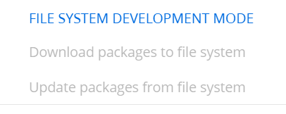

## Необходимо включить режим работы с внешними IDE


Doc: https://academy.creatio.com/docs/8.x/dev/development-on-creatio-platform/development-tools/external-ides/basics

1. Terrasoft.WebHost.dll.config
```text
<fileDesignMode enabled="true"/>
```

```text
<add key="UseStaticFileContent" value="false"/>
```

Заново войти.